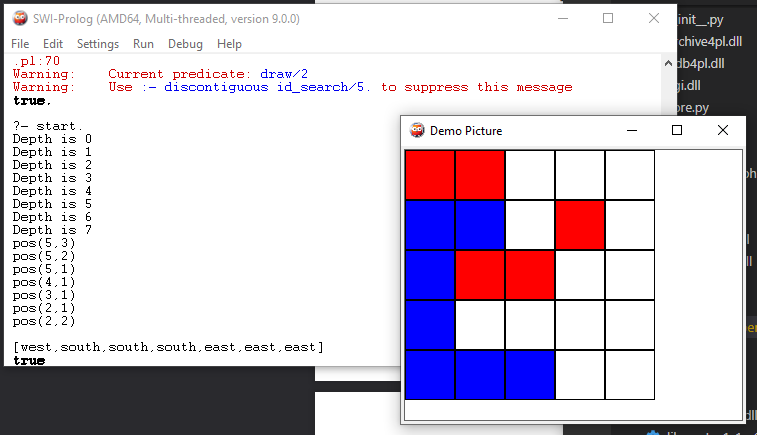

# Labyrinth Game

A Prolog pathfinding project that searches obstacle-filled grids using iterative deepening and visualizes the path.

**Status:** Search-algorithm project  
**Tools:** SWI-Prolog · Python · PySwip

## What this project does

- Define starts, goals, and obstacles in maze files.
- Run iterative deepening over multiple included maze sizes.
- Use a Python/PySwip entry point and Prolog utilities for search and display.

## How it works


Maze definition → Increasing depth limit → Path search → Visualization

## Repository guide

- [`main.py`](main.py)
- [`iterative_deepening.pl`](iterative_deepening.pl)
- [`labyrinth/loader.pl`](labyrinth/loader.pl)
- [`labyrinth/actions.pl`](labyrinth/actions.pl)
- [`Test.png`](Test.png)

## Setup and use

Install SWI-Prolog and a compatible PySwip package in a Python environment. Review the selected maze in `labyrinth/loader.pl`, then run the checked-in entry point:

```sh
python main.py
```

## Current limits

The earlier README named game.pl, which is not in the tree. This repository also includes teaching examples; their presence is not a claim of a separate finished application.

## Screenshot



## Portfolio

[Project details and related work](https://azka1212.github.io/Azka-AI-Developer/#projects)

> Documentation was checked against the repository source. Unless explicitly stated, setup commands describe the intended entry points and were not executed as part of this documentation update.
